# Laporan 1: Review Dasar Pemrograman Java
**Mata Kuliah:** Praktikum Pemrograman Desain Pattern  
**Nama:**[Natasya kamila putri]  
**NIM:** [2024573010050]  
**Kelas:** [TI 2A]

---

## Abstrak
Mata kuliah Design Pattern membutuhkan pemahaman yang kuat terhadap konsep dasar pemrograman sebagai fondasi dalam merancang solusi perangkat lunak yang terstruktur dan efisien. Modul Review Dasar Pemrograman Java disusun untuk memperkuat kembali pemahaman mahasiswa mengenai sintaks dasar serta konsep fundamental dalam bahasa pemrograman Java. Materi yang dibahas mencakup pengenalan Java dan lingkungan pengembangannya, variabel dan tipe data, operator dan ekspresi, struktur percabangan (if-else dan switch-case), serta perulangan (for, while, dan do-while).

Modul ini dirancang untuk memberikan gambaran ringkas mengenai capaian pembelajaran yang ditargetkan, yaitu kemampuan memahami sintaks dasar Java dan mengimplementasikannya dalam penyusunan program sederhana. Dengan penekanan pada penerapan konsep variabel, tipe data, operator, percabangan, dan perulangan, mahasiswa diarahkan untuk membangun pola pikir komputasional yang sistematis. Pemahaman tersebut menjadi landasan konseptual yang mendukung kesiapan mahasiswa dalam memasuki pembahasan pola desain perangkat lunak pada tahap pembelajaran selanjutnya.

---

##  1. Pendahuluan

Perkembangan teknologi perangkat lunak menuntut kemampuan pemrograman yang tidak hanya berfokus pada penulisan kode, tetapi juga pada pemahaman logika dan struktur program. Dalam konteks mata kuliah Design Pattern, pemahaman dasar pemrograman menjadi pondasi utama sebelum memasuki pembahasan pola perancangan perangkat lunak yang lebih konseptual. Bahasa Java dipilih karena bersifat berorientasi objek, memiliki sintaks yang relatif mudah dipahami, serta didukung oleh berbagai lingkungan pengembangan seperti IntelliJ IDEA, Eclipse, dan NetBeans.

Review dasar pemrograman Java dalam modul ini bertujuan untuk menyegarkan kembali konsep-konsep fundamental seperti variabel, tipe data, operator, percabangan, dan perulangan. Dengan memahami kembali konsep tersebut, mahasiswa diharapkan mampu membangun logika pemrograman yang sistematis dan menyelesaikan masalah sederhana secara efektif sebagai bekal untuk memahami materi design pattern secara lebih mendalam.

---

## 2.  Pratikum

### langkah pratikum

1. Pastikan JDK dan Intellij IDE Community Edition sudah terinstal. Jika belum, kunjungi url berikut untuk mengunduh JDK Amazon Correto dan Intellij

2. Buka IDE dan buat sebuah project baru dengan ketentuan seperti berikut:

   Name: ti_design_pattern

   Location: disesuaikan

   Build system: Intellij

   JDK: Amazon Correto

   Hilangkan centang pada bagian add sample code

3. Buat sebuah package baru di dalam folder src dengan cara klik kanan pada folder src kemudian pilih New -> Package. Beri nama pratikum_1

4. Buat Sebuah class didalam package pratikum_1 dengan cara klik kanan dan pilih New -> Java Class. Beri nama HelloWorld

5. ketik kode programnya

       package pratikum_1;

       public class HelloWorld {
       public static void main(String[] args){
       System.out.println("Hello, World!");
        }
       }

### screenshot hasil
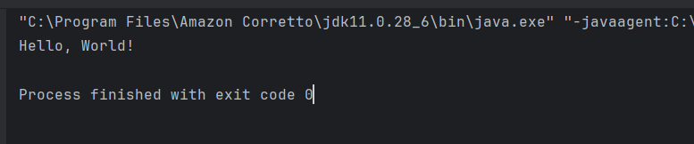

### Praktikum 1 - Variabel dan Tipe Data

Variabel digunakan untuk menyimpan data dalam program. Setiap variabel memiliki tipe data yang menentukan jenis nilai yang dapat disimpan. Tipe data dasar di Java:

int: Bilangan bulat (contoh: 10, -5)

double: Bilangan desimal (contoh: 3.14, -0.5)

boolean: Nilai true atau false

char: Karakter tunggal (contoh: 'A', '1')

String: Teks (contoh: "Hello")

### Langkah Praktikum
1. buat file baru di dalam package pratikum_1 dengan nama Variabel
2. ketik kode programnya

       package pratikum_1;

       public class Variable {
       public static void main(String[] args){
       int umur = 20;
       double tinggi = 1.75;
       boolean isMahasiswa = true;
       char jenisKelamin = 'L';
       String nama = "Budi";

        System.out.println("Nama: " + nama);
        System.out.println("Umur: " + umur);
        System.out.println("Tinggi: " + tinggi );
        System.out.println("Mahasiswa: " + isMahasiswa);
        System.out.println("Jenis Kelamin: " + jenisKelamin);
        }
       }

#### Screenshoot Hasil

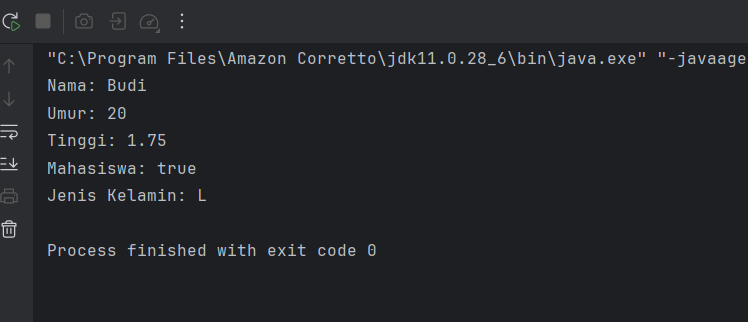

### analisis dan pembahasan
Kode program Java tersebut merupakan contoh sederhana yang menunjukkan penggunaan variabel dengan berbagai tipe data dan cara menampilkan nilainya ke layar. Program berada dalam paket pratikum_1 dan memiliki kelas Variable dengan method main sebagai titik awal eksekusi program. Di dalam method main dideklarasikan beberapa variabel yaitu umur bertipe int, tinggi bertipe double, isMahasiswa bertipe boolean, jenisKelamin bertipe char, dan nama bertipe String. Setiap variabel menyimpan data yang berbeda sesuai tipe datanya. Selanjutnya, nilai dari variabel tersebut ditampilkan ke layar menggunakan System.out.println() dengan menggabungkan teks dan variabel menggunakan operator +. Program ini bertujuan memperkenalkan dasar pemrograman Java seperti penggunaan variabel, tipe data, dan output.

### tugas latihan 1

### langkah pratikum
1. buat file baru di dalam package latihan dengan nama data diri
2. ketik kode programnya

       package pratikum_1.latihan;

       public class DataDiri {
       public static void main(String[] args){
       String nama = "Natasya kamila putri";
       String TempatLahir= "Lhokseumawe";
       String TanggalLahir= "30 mei 2006";
       String GolonganDarah= "A";
       int umur = 20;
       double tinggi = 1.50;
       char jenisKelamin = 'P';
       String Agama = "Islam";
       String Pekerjaan = "Mahasiswa";

        System.out.println("Nama: " + nama);
        System.out.println("Tempat lahir: " + TempatLahir);
        System.out.println("Tanggal Lahir: " + TanggalLahir);
        System.out.println("Golongan Darah: " + GolonganDarah);
        System.out.println("Umur:" + umur);
        System.out.println("Tinggi:" + tinggi);
        System.out.println("Jenis Kelamin:" + jenisKelamin);
        System.out.println("Agama: " + Agama);
        System.out.println("Pekerjaan: " + Pekerjaan);

         }
        }

#### Screenshot hasil
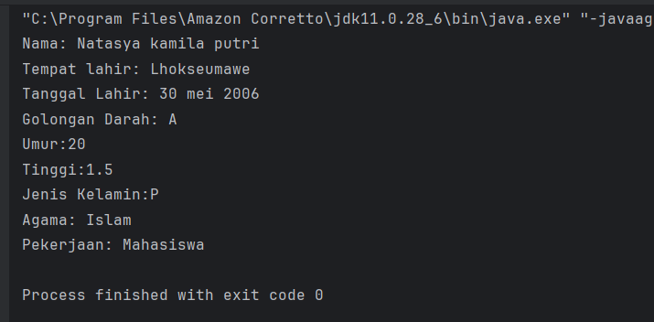

### analisis dan pembahasan
Kode program Java tersebut digunakan untuk menyimpan dan menampilkan data diri seseorang. Program berada dalam paket pratikum_1.latihan dengan kelas DataDiri yang memiliki method main sebagai awal eksekusi program. Di dalamnya terdapat beberapa variabel dengan tipe data berbeda seperti String untuk teks, int untuk umur, double untuk tinggi badan, dan char untuk jenis kelamin. Nilai dari setiap variabel kemudian ditampilkan ke layar menggunakan System.out.println(). Program ini bertujuan melatih penggunaan variabel, tipe data, dan output dalam Java.

### Praktikum 1 - Operator dan Expressi

operator dan ekspresi dalam pemrograman menjelaskan cara melakukan operasi terhadap variabel atau nilai dalam suatu program. Operator adalah simbol yang digunakan untuk melakukan suatu operasi, sedangkan ekspresi merupakan gabungan dari variabel, nilai, dan operator yang menghasilkan suatu nilai tertentu. Operator sangat penting dalam pemrograman karena digunakan untuk melakukan perhitungan, perbandingan, maupun pengolahan kondisi logika.

Jenis-jenis operator dalam pemrograman antara lain:

Operator Aritmatika: digunakan untuk melakukan operasi perhitungan matematika seperti penjumlahan, pengurangan, perkalian, pembagian, dan sisa bagi. Contohnya +, -, *, /, %.

Operator Perbandingan: digunakan untuk membandingkan dua nilai dan menghasilkan nilai logika berupa true atau false. Contohnya ==, !=, >, <, >=, <=.

Operator Logika: digunakan untuk menggabungkan atau memanipulasi kondisi logika dalam suatu program. Contohnya && (AND), || (OR), dan ! (NOT).

### Langkah Praktikum
1. buat file baru di dalam package pratikum_1 dengan nama operator
2. ketik kode programnya

       package pratikum_1;

       public class Operator {
       public static void main(String[] args) {
       int a = 10;
       int b = 5;

        System.out.println("a + b = " + (a + b));
        System.out.println("a > b? " + (a > b));
        System.out.println("a == b? " + (a == b));
         }
        }

#### Screenshot hasil
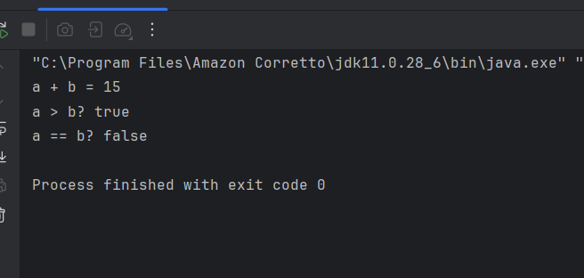

### analisis dan pembahasan
Kode program Java tersebut menunjukkan penggunaan operator aritmatika dan operator perbandingan. Program berada dalam paket pratikum_1 dengan kelas Operator dan method main sebagai awal eksekusi. Di dalamnya terdapat dua variabel bertipe int, yaitu a = 10 dan b = 5. Program kemudian menampilkan hasil operasi a + b sebagai penjumlahan, a > b untuk membandingkan apakah a lebih besar dari b, dan a == b untuk memeriksa apakah kedua nilai sama. Hasil dari operasi tersebut ditampilkan menggunakan System.out.println().

### tugas latihan 2

### langkah pratikum
1. buat file baru di dalam package latihan dengan nama persegi panjang
2. ketik kode programnya

       package pratikum_1.latihan;

        import java.util.Scanner;

       public class PersegiPanjang {
       public static void main(String[] args){
       Scanner input = new
       Scanner(System.in);

        System.out.println("Masukkan panjang: ");
        int panjang = input.nextInt();

        System.out.println("masukkan lebar:");
        int lebar = input.nextInt();
        int luas = panjang * lebar;

        System.out.println("Luas persegi panjang = " + luas);
          }
         }

#### Screenshot hasil
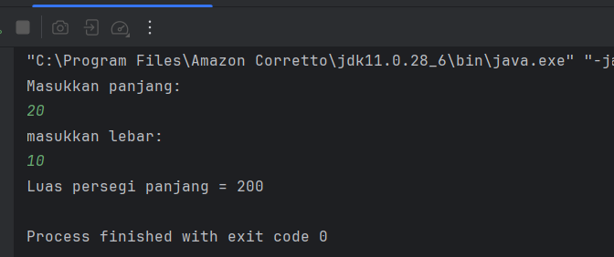

### analisis dan pembahasan
Kode program Java tersebut digunakan untuk menghitung luas persegi panjang dari input pengguna. Program menggunakan Scanner untuk menerima nilai panjang dan lebar dari keyboard yang disimpan dalam variabel bertipe int. Nilai tersebut kemudian dihitung dengan rumus panjang * lebar untuk mendapatkan luas. Hasil perhitungan ditampilkan ke layar menggunakan System.out.println().

### Praktikum 1 - Percabangan (If-Else dan Switch-Case)
Percabangan dalam pemrograman digunakan untuk mengambil keputusan berdasarkan suatu kondisi sehingga program dapat menjalankan perintah yang berbeda sesuai dengan hasil kondisi yang diperiksa. Salah satu bentuk percabangan adalah if-else, yang digunakan untuk mengecek suatu kondisi. Jika kondisi bernilai true, maka blok kode pada if dijalankan, sedangkan jika bernilai false, maka blok kode pada else dijalankan.

Selain itu terdapat switch-case, yaitu percabangan yang digunakan untuk memilih satu dari beberapa kemungkinan nilai suatu variabel. Program akan menjalankan case yang sesuai dengan nilai variabel, dan jika tidak ada yang cocok maka bagian default akan dijalankan. Struktur ini biasanya digunakan ketika terdapat banyak pilihan kondisi agar kode lebih rapi dan mudah dibaca.

### Langkah Praktikum
1. buat file baru di dalam package pratikum_1 dengan nama percabangan
2. ketik kode programnya

       package pratikum_1;

       public class Percabangan {
       public static void main(String[] args){
        int nilai = 85;

        if (nilai >= 75) {
            System.out.println("Anda Lulus!");
        } else {
            System.out.println("Anda tidak Lulus.");
          }
         }
       }

#### Screenshot hasil
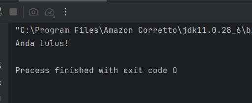

### analisis dan pembahasan

Kode program Java tersebut menunjukkan penggunaan percabangan if-else untuk menentukan hasil berdasarkan suatu kondisi. Program berada dalam paket pratikum_1 dengan kelas Percabangan dan method main sebagai awal eksekusi program. Di dalam program terdapat variabel nilai bertipe int yang bernilai 85.

Program kemudian menggunakan pernyataan if untuk memeriksa apakah nilai tersebut lebih besar atau sama dengan 75. Jika kondisi tersebut bernilai true, maka program akan menampilkan pesan “Anda Lulus!”. Namun jika kondisi bernilai false, maka program akan menampilkan pesan “Anda tidak Lulus.”. Karena nilai yang diberikan adalah 85, maka kondisi terpenuhi sehingga output yang ditampilkan adalah “Anda Lulus!”.

### latihan 3

### langkah pratikum
1. buat file baru di dalam package latihan dengan nama forganjil
2. ketik kode programnya

       package pratikum_1.latihan;

       public class ForGanjil {
       public static void main(String[] args){
       for (int i = 1; i <= 20; i++) {
       System.out.println("Itersi ke-" + i);
       }
       }
       }

### screenshoot hasil 
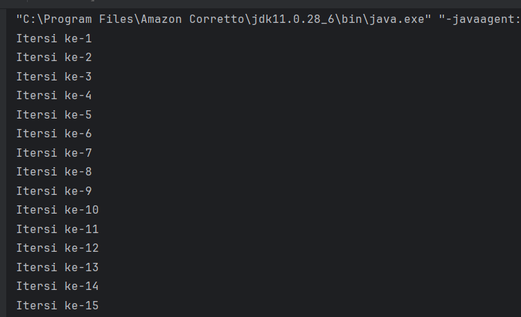
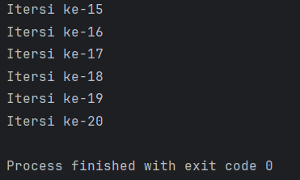

### analisis dan pembahasan

Kode program Java tersebut menggunakan perulangan for untuk menjalankan suatu perintah secara berulang. Program berada dalam paket pratikum_1.latihan dengan kelas ForGanjil dan method main sebagai awal eksekusi program.

Di dalam program terdapat perulangan for yang dimulai dari nilai i = 1 hingga i <= 20. Setiap perulangan nilai i akan bertambah satu (i++). Pada setiap iterasi, program menampilkan teks "Iterasi ke-" yang digabungkan dengan nilai i menggunakan System.out.println(). Akibatnya, program akan menampilkan tulisan Iterasi ke-1 sampai Iterasi ke-20 secara berurutan.

### latihan 4

### langkah pratikum
1. buat file baru di dalam package latihan dengan nama while ganjil
2. ketik kode programnya

       package pratikum_1.latihan;

       public class WhileGanjil {
       public static void main(String[] args){
       int i = 1;

        while (i <= 20) {
                System.out.println(i);
                i++;
            }

            }
        }

### screnshoot hasil
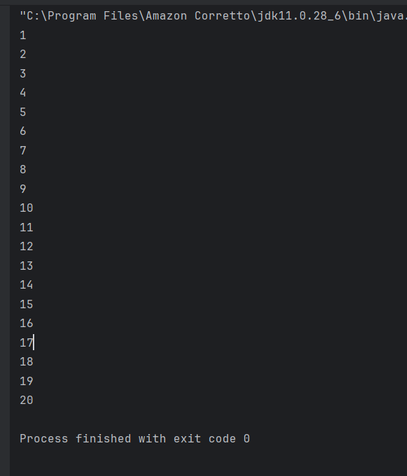

### analisis dan pembahasan

Kode program Java tersebut menggunakan perulangan while untuk menampilkan angka secara berulang. Program berada dalam paket pratikum_1.latihan dengan kelas WhileGanjil dan method main sebagai awal eksekusi program. Di dalam program terdapat variabel i bertipe int yang bernilai awal 1.

Perulangan while akan terus dijalankan selama kondisi i <= 20 bernilai true. Pada setiap perulangan, program menampilkan nilai i menggunakan System.out.println() kemudian nilai i ditambah satu dengan i++. Proses ini berlangsung sampai nilai i lebih dari 20, sehingga program akan menampilkan angka 1 sampai 20 secara berurutan.

### latihan 5

### langkah pratikum
1. buat file baru di dalam package latihan dengan nama do-while ganjil
2. ketik kode programnya

       package pratikum_1.latihan;

       public class DoWhileGanjil {
       public static void main(String[] args){
        int i = 1;
 
        do {
                System.out.println(i);
            i++;
        } while (i <= 20);

            }
        }

### screenshot hasil
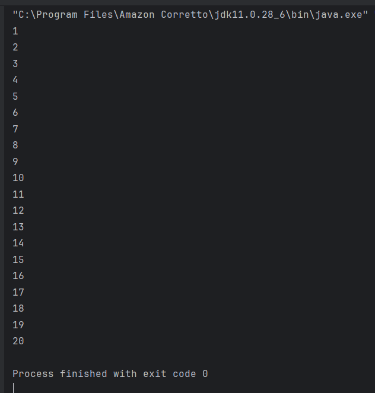

### analisis dan pembahasan

Kode program Java tersebut menggunakan perulangan do-while untuk menampilkan angka secara berurutan. Program berada dalam paket pratikum_1.latihan dengan kelas DoWhileGanjil dan method main sebagai awal eksekusi program. Di dalam program terdapat variabel i bertipe int yang bernilai awal 1.

Perulangan do-while akan menjalankan blok kode terlebih dahulu, kemudian memeriksa kondisi i <= 20. Pada setiap perulangan program menampilkan nilai i menggunakan System.out.println() lalu nilai i ditambah satu dengan i++. Proses ini akan terus berlangsung sampai nilai i lebih dari 20, sehingga program menampilkan angka 1 sampai 20 secara berurutan.

### pratikum 1 -  Practice Problem dan Solusinya

Practice problem dalam pemrograman merupakan latihan yang digunakan untuk melatih pemahaman konsep dan kemampuan menyelesaikan masalah dalam membuat program. Latihan ini membantu meningkatkan logika pemrograman serta keterampilan menggunakan struktur dasar seperti variabel, percabangan, dan perulangan.

Contoh practice problem antara lain membuat program untuk menghitung faktorial suatu bilangan, mengecek apakah suatu bilangan termasuk bilangan prima, dan mencetak pola segitiga menggunakan tanda (*) dengan memanfaatkan perulangan dalam program.

### langkah pratikum 

1. buat file baru di dalam package pratikum 1 dengan nama factorial
2. ketik kode programnya

       package pratikum_1;

       public class Faktorial {
       public static void main(String[] args) {
       int n = 5;
       int hasil = 1;
       for (int i = 1; i <= n; i++) {
       hasil *= i;
       }
       System.out.println("Faktorial dari " + n + " adalah " + hasil);
       }
       }

### screenshot hasil
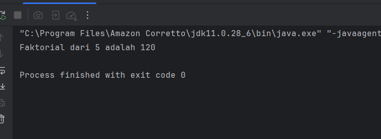

### analisis dan pembahasan

Kode program Java tersebut digunakan untuk menghitung faktorial dari suatu bilangan menggunakan perulangan for. Program berada dalam paket pratikum_1 dengan kelas Faktorial dan method main sebagai awal eksekusi program. Di dalam program terdapat variabel n bernilai 5 sebagai bilangan yang akan dihitung faktorialnya dan variabel hasil yang diinisialisasi dengan nilai 1 untuk menyimpan hasil perkalian.

Program kemudian menggunakan perulangan for yang berjalan dari i = 1 sampai i <= n. Pada setiap perulangan, nilai hasil dikalikan dengan i menggunakan operasi hasil *= i. Setelah perulangan selesai, program menampilkan hasil faktorial menggunakan System.out.println(). Dengan nilai n = 5, hasil faktorial yang diperoleh adalah 120.

### langkah pratikum

1. buat file baru di dalam package pratikum 1 dengan nama prima
2. ketik kode programnya

       package pratikum_1;

       public class Prima {
        public static void main(String[] args) {
       int n = 7;
       boolean isPrima = true;
       for (int i = 2; i <= n / 2; i++) {
       if (n % i == 0) {
       isPrima = false;
        break;
        }
        }
       System.out.println(n + (isPrima ? " adalah bilangan prima." : " bukan bilangan prima."));
        }
        }

### screenshot hasil
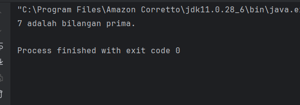

### analisis dan pembahasan

Kode program Java tersebut digunakan untuk mengecek apakah suatu bilangan merupakan bilangan prima atau bukan. Program berada dalam paket pratikum_1 dengan kelas Prima dan method main sebagai awal eksekusi program. Di dalam program terdapat variabel n bernilai 7 yang akan diperiksa, serta variabel isPrima bertipe boolean yang bernilai awal true.

Program menggunakan perulangan for dari i = 2 hingga i <= n/2 untuk memeriksa apakah n habis dibagi oleh bilangan lain selain 1 dan dirinya sendiri. Jika ditemukan bilangan yang dapat membagi n (n % i == 0), maka isPrima diubah menjadi false dan perulangan dihentikan dengan break. Setelah proses pengecekan selesai, program menampilkan hasil menggunakan System.out.println() dengan operator ternary untuk menentukan apakah bilangan tersebut prima atau bukan. Karena nilai n adalah 7, maka hasilnya menunjukkan bahwa 7 adalah bilangan prima.

### langkah pratikum

1. buat file baru di dalam package pratikum 1 dengan nama segitiga
2. ketik kode programnya

       package pratikum_1;

       public class Segitiga {
       public static void main(String[] args) {
       int tinggi = 5;
       for (int i = 1; i <= tinggi; i++) {
        for (int j = 1; j <= i; j++) {
       System.out.print("* ");
       }
       System.out.println();
       }
       }
       }

### screenshot hasil
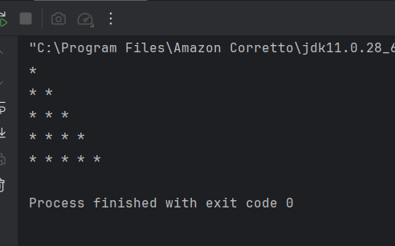

### analisis dan pembahasan

Kode program Java tersebut digunakan untuk mencetak pola segitiga menggunakan tanda bintang (*). Program berada dalam paket pratikum_1 dengan kelas Segitiga dan method main sebagai awal eksekusi program. Di dalam program terdapat variabel tinggi bernilai 5 yang menentukan tinggi atau jumlah baris segitiga.

Program menggunakan perulangan bersarang (nested loop). Perulangan pertama (for i) mengatur jumlah baris dari 1 sampai nilai tinggi. Perulangan kedua (for j) digunakan untuk mencetak tanda * sebanyak nilai baris saat itu. Perintah System.out.print("* ") digunakan untuk mencetak bintang pada baris yang sama, sedangkan System.out.println() digunakan untuk pindah ke baris berikutnya. Hasilnya, program akan menampilkan pola segitiga bintang dengan tinggi 5 baris.

## 3. Kesimpulan
Berdasarkan praktikum Review Dasar Pemrograman Java, dapat disimpulkan bahwa pemahaman dasar pemrograman Java sangat penting sebelum mempelajari materi yang lebih lanjut seperti design pattern. Dalam praktikum ini dipelajari beberapa konsep dasar seperti pengenalan Java dan lingkungan pengembangannya, variabel dan tipe data, operator dan ekspresi, percabangan menggunakan if-else dan switch-case, serta perulangan menggunakan for, while, dan do-while.

Melalui latihan atau practice problem, mahasiswa juga dapat melatih logika pemrograman dan kemampuan menyelesaikan masalah dengan membuat program sederhana, seperti menghitung faktorial, mengecek bilangan prima, dan mencetak pola segitiga. Dari praktikum ini dapat dipahami bahwa konsep dasar pemrograman sangat membantu mahasiswa dalam membuat program Java sederhana dan menjadi dasar untuk mempelajari materi pemrograman yang lebih kompleks.

## 4.Referensi

Modul Praktikum DESIGN PATTERN – HackMD (mohdrzu).

Praktikum 1:  review pemograman java

Diakses dari:https://hackmd.io/@mohdrzu/BkBn4sEcyl

W3Schools.
Java Methods and Strings Tutorial.
Diakses dari: https://www .w3schools.com/java/

