# Laporan 2: Review 4 Pillar OOP Menggunakan Java
**Mata Kuliah:** Praktikum Pemrograman Desain Pattern  
**Nama:**[Natasya kamila putri]  
**NIM:** [2024573010050]  
**Kelas:** [TI 2A]

---

## Abstrak
Modul ini membahas review empat pilar Pemrograman Berorientasi Objek (OOP) menggunakan bahasa Java. Tujuan modul ini adalah agar saya dan teman-teman bisa memahami konsep dasar OOP, seperti class, object, enkapsulasi, pewarisan, polimorfisme, dan abstraksi. Selain memahami teori, modul ini juga mendorong kami untuk mampu membuat program sederhana menggunakan konsep OOP, serta menerapkan prinsip-prinsip OOP dalam menyelesaikan masalah pemrograman secara lebih terstruktur dan efisien. Dengan modul ini, diharapkan kami terbiasa berpikir dan menyelesaikan masalah dengan paradigma OOP sejak awal pembelajaran.

---

##  1. Pendahuluan

OOP menjadi salah satu paradigma utama dalam dunia pemrograman saat ini. Dengan OOP, konsep seperti class, object, enkapsulasi, pewarisan, polimorfisme, dan abstraksi menjadi dasar untuk membuat program yang lebih terstruktur, mudah dikembangkan, dan efisien. Modul ini disusun untuk membantu mahasiswa memahami konsep-konsep tersebut secara menyeluruh sekaligus mempraktikkannya dalam pembuatan program sederhana.

Melalui modul ini, mahasiswa diharapkan tidak hanya memahami teori, tetapi juga mampu menerapkan prinsip OOP dalam menyelesaikan masalah pemrograman dengan cara yang sistematis. Selain itu, modul ini bertujuan membiasakan mahasiswa berpikir logis dan terstruktur, sehingga saat menghadapi tantangan pemrograman yang lebih kompleks, mereka sudah memiliki pondasi yang kuat untuk menyelesaikannya menggunakan paradigma OOP.

---

## 2.  Pratikum

### BAGIAN 1

### langkah pratikum

1. Buka project pada praktikum sebelumnya menggunakan intellij IDEA
2. Buat sebuah package baru di dalam folder src dengan cara klik kanan pada folder src kemudian pilih New -> Package. Beri nama pratikum_2.
3. Buat Sebuah package baru lagi didalam package pratikum_2 dengan cara klik kanan dan pilih New -> Package. Beri nama bagian_1
4. Kemudian buat sebuah class baru dengan nama Mahasiswa dan isikan kode berikut:

       package pratikum_2.bagian1;

       public class Mahasiswa
       {
       // Atribut
       String nama;
       int umur;

        // Metode
        void displayInfo() {
            System.out.println("Nama: " + nama);
            System.out.println("Umur: " + umur);
        }

        }

### analisis dan pembahasan

Kelas **Mahasiswa** ini menunjukkan contoh dasar pembuatan *class* di Java dengan penerapan *encapsulation* sederhana, meskipun atributnya bersifat *package-private*. Di dalamnya terdapat dua atribut, yaitu **nama** dan **umur**, yang menyimpan data seorang mahasiswa, serta metode **displayInfo()** yang berfungsi menampilkan informasi tersebut ke layar. Kode ini memperlihatkan bagaimana *class* bisa menggabungkan data dan perilaku (*methods*) dalam satu unit, sehingga setiap objek **Mahasiswa** dapat menyimpan dan menampilkan informasi spesifiknya sendiri secara rapi dan konsisten. Secara keseluruhan, program ini sederhana tetapi efektif untuk memahami konsep dasar *object-oriented programming* di Java.

### langkah pratikum
1. buat class baru di dalam package bagian1 dengan nama main
2. ketik kode programnya

       package pratikum_2.bagian1;

       public class Main {
       public static void main(String[] args) {
       // Membuat objek
       Mahasiswa mhs1 = new Mahasiswa();
       mhs1.nama = "Budi";
       mhs1.umur = 20;

        // Memanggil metode
        mhs1.displayInfo();
       }
       }

#### Screenshot hasil

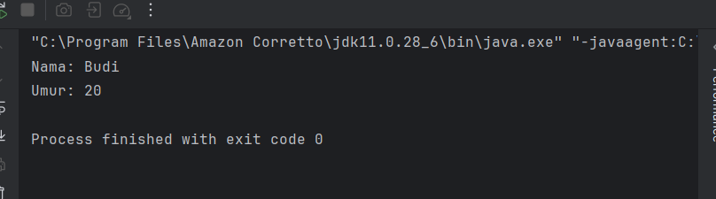

### analisis dan pembahasan
kelas  **Main** ini menunjukkan cara membuat dan menggunakan objek dari kelas **Mahasiswa**. Di sini dibuat sebuah objek bernama **mhs1**, kemudian atribut **nama** dan **umur** diisi dengan data spesifik, yaitu "Budi" dan 20. Setelah itu, metode **displayInfo()** dipanggil untuk menampilkan informasi mahasiswa tersebut ke layar. Kode ini secara sederhana memperlihatkan prinsip dasar *object-oriented programming*, di mana objek menyimpan data dan metode yang dapat digunakan untuk menampilkan atau memanipulasi data tersebut, sehingga setiap objek bisa memiliki identitas dan perilaku masing-masing secara terstruktur dan terkontrol.

### tugas latihan bagian1 (Buku)

### langkah pratikum
1. buat class baru di dalam package latihan dengan nama Buku
2. ketik kode programnya

       package pratikum_2.bagian1.latihan;

       public class Buku {
       // Atribut (encapsulation)
        private String judul;
       private String penulis;
       private int tahunTerbit; 

       // Constructor
       public Buku(String judul, String penulis, int tahunTerbit) {
        this.judul = judul;
        this.penulis = penulis;
        this.tahunTerbit = tahunTerbit;
       }

       // Getter
       public String getJudul() {
        return judul;
       }

       public String getPenulis() {
        return penulis;
       } 

       public int getTahunTerbit() {
        return tahunTerbit;
       }

        // Setter
       public void setJudul(String judul) {
        this.judul = judul;
       }

       public void setPenulis(String penulis) {
        this.penulis = penulis;
       }

        public void setTahunTerbit(int tahunTerbit) {
        this.tahunTerbit = tahunTerbit;
        }

       // Method tampilkan info
       public void tampilkanInfo() {
        System.out.println("Judul        : " + judul);
        System.out.println("Penulis      : " + penulis);
        System.out.println("Tahun Terbit : " + tahunTerbit);
       }
       }

## analisis dan pembahasan
Kelas **Buku** ini dirancang untuk mendemonstrasikan konsep *encapsulation* dalam pemrograman berorientasi objek. Semua atribut, seperti **judul**, **penulis**, dan **tahunTerbit**, dibuat bersifat *private* untuk menjaga keamanan data, sehingga hanya bisa diakses melalui metode *getter* dan *setter*. Konstruktor digunakan untuk menginisialisasi nilai awal dari atribut-atribut tersebut saat objek dibuat. Metode **tampilkanInfo()** kemudian memungkinkan informasi buku ditampilkan secara rapi ke layar. Dengan cara ini, kelas ini tidak hanya menjaga integritas data, tetapi juga menunjukkan bagaimana objek bisa memiliki properti dan perilaku yang terstruktur, sehingga setiap instance buku bisa dikelola secara aman dan fleksibel.

### langkah pratikum
1. buat class baru di dalam package latihan dengan nama Main
2. ketik kode programnya

       package pratikum_2.bagian1.latihan;

        public class Main {
        public static void main(String[] args) {

        // Membuat objek
        Buku buku1 = new Buku("Laskar Pelangi", "Andrea Hirata", 2005);

        // Menampilkan informasi awal
        System.out.println("Data Buku:");
        buku1.tampilkanInfo();

        // Update data
        buku1.setJudul("Sang Pemimpi");
        buku1.setPenulis("Andrea Hirata");
        buku1.setTahunTerbit(2006);

        // Menampilkan setelah update
        System.out.println("\nSetelah diubah:");
        buku1.tampilkanInfo();
        }
         }

#### Screenshot hasil

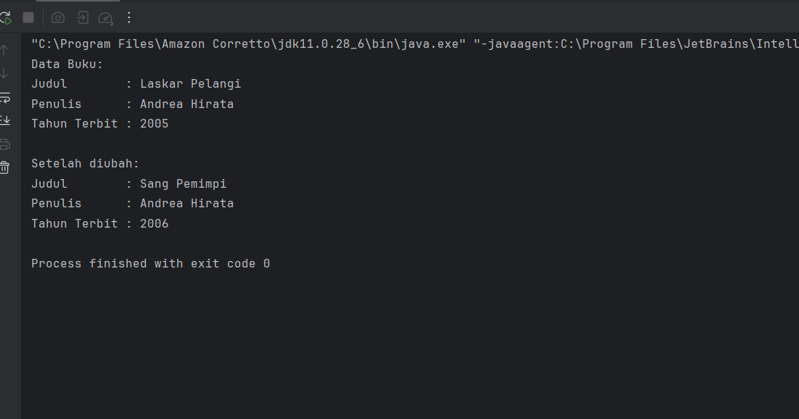

### analisis dan pembahasan
Program **Main** ini menampilkan penerapan prinsip *encapsulation* melalui penggunaan kelas **Buku**. Pada awalnya, dibuat sebuah objek **buku1** dengan data awal berupa judul, penulis, dan tahun terbit, lalu informasi tersebut ditampilkan menggunakan metode **tampilkanInfo()**. Selanjutnya, program menunjukkan fleksibilitas *setter* dengan memperbarui atribut-atribut buku, seperti judul menjadi *“Sang Pemimpi”*, penulis tetap Andrea Hirata, dan tahun terbit diubah menjadi 2006. Setelah perubahan, informasi terbaru ditampilkan kembali. Dengan demikian, program ini tidak hanya menegaskan pentingnya proteksi data melalui atribut *private*, tetapi juga memperlihatkan bagaimana objek dapat dimodifikasi secara aman melalui metode publik, menjadikan pengelolaan data lebih terstruktur dan terkendali.

### BAGIAN 2

### langkah pratikum

1. Buat Sebuah package baru lagi didalam package pratikum_2 dengan cara klik kanan dan pilih New -> Package. Beri nama bagian_2
2. Kemudian buat sebuah class baru dengan nama Mahasiswa dan isikan kode berikut:

       package pratikum_2.bagian2;

       public class Mahasiswa {
       // Atribut private
       private String nama;
       private int umur;

       // Getter dan Setter
       public String getNama() {
        return nama;
        }

       public void setNama(String nama) {
        this.nama = nama;
       }

       public int getUmur() {
        return umur;
       }

       public void setUmur(int umur) {  
        this.umur = umur;
         }
       }

## analisis dan pembahasan

Kelas **Mahasiswa** ini menunjukkan penerapan konsep *encapsulation* yang lebih baik dibandingkan versi sebelumnya, karena seluruh atribut seperti **nama** dan **umur** dibuat *private*. Dengan begitu, data tidak bisa diakses langsung dari luar kelas, melainkan harus melalui metode *getter* dan *setter*. Metode *getter* digunakan untuk mengambil nilai atribut, sedangkan *setter* berfungsi untuk mengubah nilainya secara terkontrol. Pendekatan ini membuat pengelolaan data menjadi lebih aman dan terstruktur, serta memberi fleksibilitas jika di kemudian hari ingin menambahkan validasi pada saat pengisian data. Secara keseluruhan, kode ini merepresentasikan praktik *object-oriented programming* yang lebih rapi dan sesuai dengan prinsip keamanan data.

### langkah pratikum
1. buat class baru di dalam package bagian2 dengan nama Main
2. ketik kode programnya

       package pratikum_2.bagian2;

       public class Main {
       public static void main(String[] args) {
       Mahasiswa mhs1 = new Mahasiswa();
       mhs1.setNama("Budi");
       mhs1.setUmur(20);

        System.out.println("Nama: " + mhs1.getNama());
        System.out.println("Umur: " + mhs1.getUmur());
        }
         }

#### Screenshot hasil

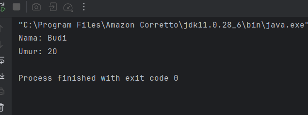

### analisis dan pembahasan

Program **Main** ini memperlihatkan cara penggunaan kelas **Mahasiswa** yang sudah menerapkan *encapsulation*. Objek **mhs1** dibuat tanpa mengakses atribut secara langsung, melainkan menggunakan metode **setter** untuk mengisi nilai **nama** dan **umur**. Selanjutnya, nilai tersebut ditampilkan melalui metode **getter**, sehingga akses terhadap data tetap terkontrol. Pendekatan ini menunjukkan bahwa interaksi dengan atribut dilakukan melalui perantara metode, bukan secara langsung, sehingga lebih aman dan terstruktur. Secara keseluruhan, program ini menegaskan pentingnya penggunaan *getter* dan *setter* dalam menjaga konsistensi serta keamanan data dalam pemrograman berorientasi objek.

### tugas latihan bagian2 (Motor)

### langkah pratikum
1. buat class baru di dalam package latihan dengan nama Motor
2. ketik kode programnya

       package pratikum_2.bagian2.latihan;

       public class Motor {
       // 1. Atribut yang dienkapsulasi (menggunakan private)
       private String merk;
       private int tahun;

       // 2. Getter untuk atribut merk
       public String getMerk() {
        return merk;
       }

        // Setter untuk atribut merk
       public void setMerk(String merk) {
        this.merk = merk;
        }

        // Getter untuk atribut tahun
        public int getTahun() {
        return tahun;
        } 

        // Setter untuk atribut tahun
       public void setTahun(int tahun) {
        this.tahun = tahun;
         }
       }

### analisis dan pembahasan 

Kelas **Motor** ini merupakan contoh penerapan *encapsulation* dalam Java, di mana atribut **merk** dan **tahun** dibuat *private* agar tidak dapat diakses langsung dari luar kelas. Akses terhadap data tersebut dilakukan melalui metode *getter* dan *setter*, sehingga proses pengambilan maupun pengubahan nilai tetap terkontrol. Dengan adanya metode ini, setiap perubahan data dapat diatur dengan lebih aman dan fleksibel, misalnya jika nanti ingin ditambahkan validasi. Secara keseluruhan, struktur kelas ini menunjukkan praktik *object-oriented programming* yang baik karena mampu melindungi data sekaligus menjaga kerapian dan keteraturan dalam pengelolaan atribut.

### langkah pratikum
1. buat class baru di dalam package latihan dengan nama Main
2. ketik kode programnya

        package pratikum_2.bagian2.latihan;

        public class Main {
        public static void main(String[] args) {
        // Membuat objek motorBaru
       Motor motorBaru = new Motor();

        // Mengisi data menggunakan setter
        motorBaru.setMerk("Honda Vario");
        motorBaru.setTahun(2024);

        // Mengambil data menggunakan getter
        System.out.println("Merk Motor: " + motorBaru.getMerk());
        System.out.println("Tahun Motor: " + motorBaru.getTahun());
         }
       }

### screenshot hasil

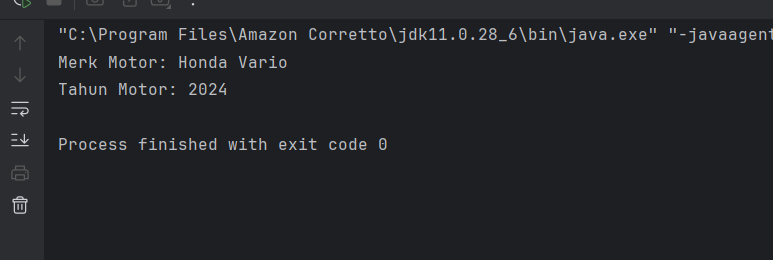

### analisis dan pembahasan 

Program **Main** ini memperlihatkan cara penggunaan kelas **Motor** yang telah menerapkan konsep *encapsulation*. Objek **motorBaru** dibuat, kemudian nilai atribut diisi melalui metode **setter**, yaitu untuk **merk** dan **tahun**, sehingga data tidak diakses secara langsung. Setelah itu, informasi yang telah disimpan ditampilkan menggunakan metode **getter**, yang berfungsi sebagai penghubung untuk mengambil data secara aman. Pendekatan ini menunjukkan bahwa pengelolaan atribut dilakukan secara terstruktur dan terkontrol, sehingga lebih menjaga konsistensi serta keamanan data. Secara keseluruhan, program ini menegaskan pentingnya penggunaan *getter* dan *setter* dalam praktik *object-oriented programming*.

### BAGIAN 3

### langkah pratikum

1. Buat Sebuah package baru lagi didalam package pratikum_2 dengan cara klik kanan dan pilih New -> Package. Beri nama bagian_3
2. Buat package baru di dalam bagian_3 dan beri nama pewarisan
3. Kemudian buat sebuah class baru dengan nama Kendaraan dan isikan kode berikut:

       package pratikum_2.bagian3.pewarisan;

       public class Kendaraan {
       String merk;
       int tahun;

       void displayInfo() {
        System.out.println("Merk: " + merk);
        System.out.println("Tahun: " + tahun);
         }
       }

### analisis dan pembahasan

Kelas **Kendaraan** ini merupakan contoh dasar penerapan konsep *inheritance* dalam Java, yang nantinya bisa dijadikan sebagai *superclass* untuk kelas turunan lainnya. Kelas ini memiliki dua atribut, yaitu **merk** dan **tahun**, yang merepresentasikan informasi umum dari sebuah kendaraan. Selain itu, terdapat metode **displayInfo()** yang berfungsi untuk menampilkan data tersebut ke layar. Struktur kelas yang sederhana ini menunjukkan bagaimana sebuah kelas induk dapat menyediakan atribut dan metode dasar yang dapat diwariskan dan digunakan kembali oleh subclass, sehingga memudahkan pengembangan program menjadi lebih terstruktur dan efisien.

### langkah pratikum
1. buat class baru di dalam package bagian 3 dengan nama Mobil
2. ketik kode programnya

       package pratikum_2.bagian3.pewarisan;

        class Mobil extends Kendaraan {
         int jumlahPintu;

        void displayInfoMobil() {
        displayInfo(); // Memanggil metode dari superclass
        System.out.println("Jumlah Pintu: " + jumlahPintu);
         }
        }

### analisis dan pembahasan

Kelas **Mobil** merupakan turunan dari kelas **Kendaraan**, sehingga mencerminkan penerapan konsep *inheritance* dalam pemrograman berorientasi objek. Melalui pewarisan ini, kelas **Mobil** secara otomatis memperoleh atribut **merk** dan **tahun** serta metode **displayInfo()** dari kelas induknya. Selain itu, kelas ini menambahkan atribut baru yaitu **jumlahPintu** sebagai ciri khusus yang membedakannya dari kelas **Kendaraan**. Metode **displayInfoMobil()** digunakan untuk menampilkan seluruh informasi, dengan cara memanggil metode dari *superclass* terlebih dahulu, kemudian dilanjutkan dengan menampilkan atribut tambahan. Hal ini menunjukkan bahwa subclass dapat memperluas fungsi dari kelas induk tanpa perlu menulis ulang kode yang sudah ada, sehingga program menjadi lebih efisien dan terstruktur.

### langkah pratikum
1. buat class baru di dalam package bagian 3 dengan nama Main
2. ketik kode programnya

        package pratikum_2.bagian3.pewarisan;

        public class Main {
        public static void main(String[] args) {
        Mobil mobil1 = new Mobil();
        mobil1.merk = "Toyota";
        mobil1.tahun = 2021;
        mobil1.jumlahPintu = 4;

        mobil1.displayInfoMobil();
          }
         }

### screenshot hasil

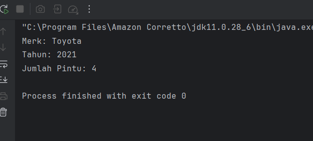

### analisis dan pembahasan

Program **Main** ini menunjukkan implementasi langsung dari konsep *inheritance* melalui penggunaan kelas **Mobil** sebagai turunan dari **Kendaraan**. Pada bagian *main*, dibuat sebuah objek **mobil1** yang kemudian diisi nilai atributnya, yaitu **merk**, **tahun**, dan **jumlahPintu**. Setelah itu, metode **displayInfoMobil()** dipanggil untuk menampilkan seluruh informasi, di mana metode tersebut secara tidak langsung juga memanfaatkan metode dari kelas induk. Hal ini memperlihatkan bahwa objek dari subclass dapat menggunakan sekaligus memperluas fitur yang diwarisi dari superclass. Secara keseluruhan, program ini menegaskan bagaimana pewarisan membantu menyederhanakan kode serta meningkatkan keteraturan dalam pengembangan program.

### langkah pratikum

1. Buat package baru di dalam bagian_3 dan beri nama komposisi
2. Kemudian buat sebuah class baru dengan nama Mesin dan isikan kode berikut:

       package pratikum_2.bagian3.komposisi;

       public class Mesin {
       void hidupkan() {
       System.out.println("Mesin menyala.");
       }

       void matikan() {
        System.out.println("Mesin dimatikan.");
         }
       }

### analisis dan pembahasan

Kelas **Mesin** pada program ini merepresentasikan konsep *composition* sebagai komponen yang nantinya dapat digunakan oleh kelas lain, misalnya kendaraan. Kelas ini memiliki dua metode sederhana, yaitu **hidupkan()** dan **matikan()**, yang berfungsi untuk menggambarkan perilaku dasar dari sebuah mesin melalui output yang ditampilkan. Meskipun terlihat sederhana, keberadaan kelas ini penting karena menunjukkan bahwa suatu objek dapat menjadi bagian dari objek lain, bukan melalui pewarisan, melainkan melalui hubungan kepemilikan (*has-a relationship*). Dengan pendekatan ini, struktur program menjadi lebih modular dan fleksibel, karena setiap komponen memiliki tanggung jawabnya masing-masing.

### langkah pratikum

1. buat class baru lagi  di dalam package komposisi dengan nama Mobil
2. ketik kode programnya

       package pratikum_2.bagian3.komposisi;

       public class Mobil {
       private final Mesin mesin; // Composition

       public Mobil() {
        this.mesin = new Mesin(); // Membuat objek Mesin
        }

       void mulai() {
        mesin.hidupkan();
        System.out.println("Mobil siap digunakan.");
        }

       void berhenti() {
        mesin.matikan();
        System.out.println("Mobil berhenti.");
         }
        } 

### analisis dan pembahasan

Kelas **Mobil** pada kode ini menunjukkan penerapan konsep *composition*, di mana objek **Mobil** memiliki objek **Mesin** sebagai bagian internalnya. Hal ini terlihat dari atribut **mesin** yang bertipe **Mesin** dan diinisialisasi langsung di dalam konstruktor, sehingga setiap objek **Mobil** pasti memiliki komponen mesin. Metode **mulai()** dan **berhenti()** kemudian memanfaatkan fungsi dari objek **Mesin** dengan memanggil metode **hidupkan()** dan **matikan()**, lalu menambahkan informasi tambahan terkait kondisi mobil. Pendekatan ini menegaskan hubungan *has-a*, di mana mobil tidak mewarisi mesin, tetapi menggunakannya sebagai bagian penyusun. Secara keseluruhan, desain ini membuat kode lebih terorganisir dan fleksibel karena setiap kelas memiliki peran yang jelas dan terpisah.

### langkah pratikum

1. buat class baru lagi  di dalam package komposisi dengan nama Main
2. ketik kode programnya

       package pratikum_2.bagian3.komposisi;

       public class Main {
       public static void main(String[] args) {
       Mobil mobil = new Mobil();
       mobil.mulai();
       mobil.berhenti();
       }
         }

### screenshoot hasil

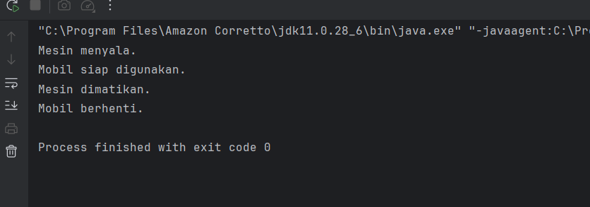

### analisis dan pembahasan

Program **Main** ini menggambarkan bagaimana konsep *composition* diimplementasikan melalui penggunaan kelas **Mobil** yang di dalamnya sudah mengandung objek **Mesin**. Pada metode *main*, dibuat sebuah objek **mobil** yang kemudian menjalankan metode **mulai()** dan **berhenti()**. Saat metode tersebut dipanggil, secara tidak langsung mobil akan memanfaatkan fungsi dari objek mesin untuk menyalakan dan mematikan sistemnya. Hal ini menunjukkan bahwa interaksi antar objek terjadi melalui hubungan kepemilikan (*has-a*), bukan pewarisan. Secara keseluruhan, program ini memperjelas bagaimana *composition* dapat digunakan untuk membangun struktur program yang lebih modular, terorganisir, dan mudah dikembangkan.

### langkah pratikum

1. Di dalam package bagian_3, buat sebuah class baru dan beri nama Main dan isikan kode berikut:

        package pratikum_2.bagian3;

        public class Main {
        // Class Mesin (Composition)
        class Mesin {
        void hidupkan() {
        System.out.println("Mesin menyala.");
        }

        void matikan() {
            System.out.println("Mesin dimatikan.");
         }
        } 

        // Superclass (Inheritance)
        class Kendaraan {
        void bergerak() {
            System.out.println("Kendaraan sedang bergerak.");
        }
        }

       // Subclass
       class Mobil extends Kendaraan {
        private Mesin mesin; // Composition

        public Mobil() {
            mesin = new Mesin();
        }

        void mulai() {
            mesin.hidupkan();
            System.out.println("Mobil siap digunakan.");
        }

        void berhenti() {
            mesin.matikan();
            System.out.println("Mobil berhenti.");
         }
        }

### analisis dan pembahasan   

Program ini memperlihatkan kombinasi konsep *composition* dan *inheritance* dalam satu struktur. Di sini, kelas **Mobil** merupakan subclass dari **Kendaraan**, sehingga mewarisi metode **bergerak()**, sekaligus memiliki objek **Mesin** sebagai bagian dari *composition*. Metode **mulai()** dan **berhenti()** pada **Mobil** memanfaatkan fungsi **Mesin** untuk menyalakan dan mematikan mesin, menunjukkan bahwa mobil “memiliki” mesin, bukan mewarisinya. Dengan pendekatan ini, program menekankan fleksibilitas desain: pewarisan memberikan kemampuan dasar kendaraan bergerak, sementara *composition* memungkinkan mobil memiliki komponen internal yang dapat diatur secara mandiri, membuat kode lebih modular dan mudah dikembangkan.

### tugas latihan bagian3 (Laptop)

### langkah pratikum
1. buat class baru di dalam package latihan dengan nama Laptop
2. ketik kode programnya

       package pratikum_2.bagian3.latihan;

       public class Laptop {
       // Komponen sebagai bagian dari Laptop
       private Processor processor;
       private RAM ram;

       // Inisialisasi melalui Constructor
       public Laptop() {
        this.processor = new Processor();
        this.ram = new RAM();
        }

       void operasikan() {
        System.out.println("Laptop dinyalakan:");
        processor.jalankan();
        ram.baca();
        ram.tulis();
         } 
        }

        // 2. Class Processor
        class Processor    
       void jalankan() {
       System.out.println("Processor sedang menjalankan instruksi...");
        }
         }

       // 3. Class RAM
       class RAM {
       void baca() {
       System.out.println("RAM sedang membaca data...");
       }

        void tulis() {
        System.out.println("RAM sedang menulis data...");
         }
       }

### analisis dan pembahasan   

Program ini menampilkan konsep *composition* di mana kelas **Laptop** memiliki komponen internal berupa **Processor** dan **RAM**. Pada konstruktor **Laptop**, kedua objek ini diinisialisasi sehingga saat metode **operasikan()** dipanggil, laptop dapat menyalakan *processor* untuk menjalankan instruksi sekaligus mengakses *RAM* untuk membaca dan menulis data. Pendekatan ini menekankan bahwa laptop bukanlah *processor* atau *RAM*, melainkan “memiliki” komponen-komponen tersebut, sehingga desainnya modular dan lebih mudah dikembangkan atau dimodifikasi tanpa memengaruhi bagian lain dari sistem.

### langkah pratikum

1. buat class baru di dalam package latihan dengan nama Main
2. ketik kode programnya

       package pratikum_2.bagian3.latihan;

       public class Main {
       public static void main(String[] args) {
       Laptop laptopSaya = new Laptop();
       laptopSaya.operasikan();
        }
         }

### screenshot hasil

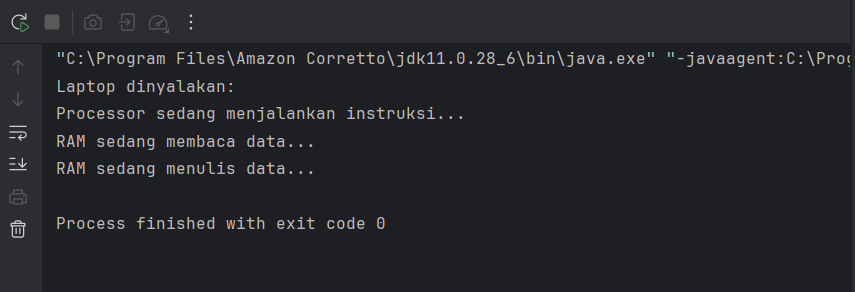

### analisis dan pembahasan  

Program **Main** ini berfungsi untuk menguji kelas **Laptop** yang sudah dibuat sebelumnya. Objek **laptopSaya** dibuat dari kelas **Laptop**, kemudian metode **operasikan()** dipanggil untuk menyalakan laptop dan menjalankan semua fungsi komponennya, yaitu *processor* yang mengeksekusi instruksi serta *RAM* yang membaca dan menulis data. Dengan cara ini, program memperlihatkan bagaimana *composition* bekerja dalam praktik, di mana kelas utama dapat mengelola dan memanfaatkan perilaku objek-objek internalnya secara terstruktur dan modular.

### BAGIAN 4

### langkah pratikum

1. Buat Sebuah package baru lagi didalam package pratikum_2 dengan cara klik kanan dan pilih New -> Package. Beri nama bagian_4
2. Kemudian buat sebuah package baru di dalam bagian_4 dan beri nama overriding
3. Kemudian buat sebuah class baru dengan nama Hewan dan isikan kode berikut:

       package pratikum_2.bagian4.Overriding;

       public class Hewan {
       void bersuara() {
       System.out.println("Hewan bersuara.");
        } 
       }

### analisis dan pembahasan 

Kelas **Hewan** ini berfungsi sebagai *superclass* sederhana yang merepresentasikan perilaku dasar hewan, yaitu kemampuan untuk bersuara melalui metode **bersuara()**. Metode ini menampilkan pesan umum "Hewan bersuara." Program ini mendemonstrasikan prinsip dasar *inheritance*, di mana kelas lain bisa mewarisi **Hewan** dan melakukan *method overriding* untuk menyesuaikan suara spesifik masing-masing hewan, sehingga konsep *polimorfisme* dapat diterapkan secara efektif.

### langkah pratikum

1. buat class baru di dalam package overriding dengan nama Kucing
2. ketik kode programnya

       package pratikum_2.bagian4.Overriding;

       public class Kucing extends Hewan{
       @Override
       void bersuara() {
       System.out.println("Meong!");
       }
        }

### analisis dan pembahasan 

Kelas **Kucing** ini merupakan *subclass* dari **Hewan** yang memperlihatkan konsep *method overriding*. Di sini, metode **bersuara()** yang awalnya generik di **Hewan** diubah agar menampilkan suara khas kucing, yaitu "Meong!". Dengan begitu, setiap objek **Kucing** akan mengeksekusi perilaku spesifik ini, sekaligus menunjukkan bagaimana *polimorfisme* memungkinkan subclass menyesuaikan implementasi metode dari superclass secara lebih spesifik.

### langkah prtaikum

1. buat class baru di dalam package overriding dengan nama Anjing
2. ketik kode programnya

       package pratikum_2.bagian4.Overriding;

       public class Anjing extends Hewan{
       @Override
       void bersuara() {
       System.out.println("Guk Guk!");
        }
       }

### analisis dan pembahasan 

Kelas **Anjing** ini adalah *subclass* dari **Hewan** yang menunjukkan penerapan *method overriding*. Metode **bersuara()** diubah dari versi umum di **Hewan** menjadi suara khas anjing, yaitu "Guk Guk!". Dengan begitu, setiap objek **Anjing** akan menampilkan perilaku yang spesifik, memperlihatkan bagaimana subclass dapat menyesuaikan fungsi superclass agar sesuai dengan karakteristiknya sendiri, sekaligus mendemonstrasikan prinsip *polimorfisme* dalam Java.

### langkah pratikum

1. buat class baru di dalam package overriding dengan nama Main
2. ketik kode programnya

       package pratikum_2.bagian4.Overriding;

       public class Main {
       public static void main(String[] args) {
       Hewan hewan1 = new Kucing(); // Polymorphism
       Hewan hewan2 = new Anjing(); // Polymorphism

        hewan1.bersuara(); // Output: Meong!
        hewan2.bersuara(); // Output: Guk Guk!
         }
        }

### screenshoot hasil

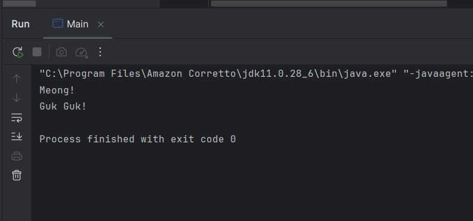

### analisis dan pembahasan 

Program **Main** ini mendemonstrasikan konsep *polimorfisme* pada Java, di mana referensi bertipe **Hewan** dapat menunjuk ke objek dari subclass yang berbeda, yaitu **Kucing** dan **Anjing**. Saat metode **bersuara()** dipanggil, Java secara otomatis mengeksekusi versi yang sesuai dengan objek sebenarnya, sehingga **hewan1** mengeluarkan "Meong!" dan **hewan2** mengeluarkan "Guk Guk!". Hal ini menegaskan fleksibilitas *method overriding* dan kemampuan *runtime polymorphism* dalam menyesuaikan perilaku objek tanpa mengubah tipe referensi formalnya.

### langkah pratikum

1. Buat sebuah package baru di dalam bagian_4 dan beri nama overloading
2. Kemudian buat sebuah class baru dengan nama Kalkulator dan isikan kode berikut:

       package pratikum_2.bagian4.overloading;

       public class Kalkulator {
       // Method overloading: penjumlahan dua bilangan bulat
       int tambah(int a, int b) {
       return a + b;
       }

        // Method overloading: penjumlahan tiga bilangan bulat
       int  tambah(int a, int b, int c) {
        return a + b + c;
        }

        // Method overloading: penjumlahan dua bilangan desimal
       double tambah(double a, double b) {
        return a + b;
        }
       }

### analisis dan pembahasan 

Kelas **Kalkulator** ini menunjukkan penerapan *method overloading* di Java, di mana satu nama metode **tambah** dapat memiliki beberapa versi dengan parameter yang berbeda. Ada versi untuk menjumlahkan dua bilangan bulat, tiga bilangan bulat, dan dua bilangan desimal. Dengan begitu, pemanggilan metode otomatis menyesuaikan dengan tipe dan jumlah argumen yang diberikan, sehingga membuat kode lebih fleksibel dan mudah digunakan tanpa harus membuat nama metode yang berbeda untuk setiap variasi operasi penjumlahan.

### langkah pratikum
1.buat class baru di dalam package overloading dengan nama Main
2. ketik kode programnya

       package pratikum_2.bagian4.overloading;

       public class Main {
       public static void main(String[] args) {
        Kalkulator kalkulator = new Kalkulator();

        System.out.println("Hasil 1: " + kalkulator.tambah(5, 10)); // Output: 15
        System.out.println("Hasil 2: " + kalkulator.tambah(5, 10, 15)); // Output: 30
        System.out.println("Hasil 3: " + kalkulator.tambah(3.5, 2.5)); // Output: 6.0
         }
        }

### screenshoot hasil

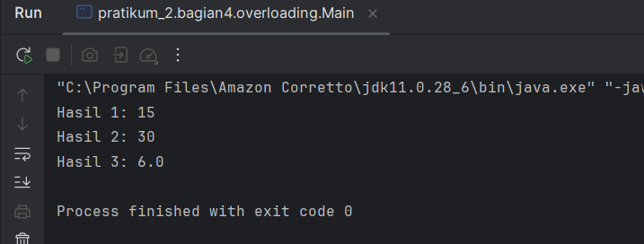

### analisis dan pembahasan

Program ini mendemonstrasikan konsep *method overloading* melalui kelas **Kalkulator**, di mana satu metode **tambah** bisa dipanggil dengan parameter yang berbeda sesuai kebutuhan. Pada **Main**, dibuat objek kalkulator dan dipanggil tiga versi metode: penjumlahan dua bilangan bulat, tiga bilangan bulat, dan dua bilangan desimal. Hasil yang dicetak menunjukkan bahwa Java secara otomatis memilih metode yang sesuai dengan tipe dan jumlah argumen, sehingga penggunaan metode menjadi lebih fleksibel dan efisien tanpa perlu membuat nama metode berbeda untuk setiap variasi operasi.

### tugas latihan bagian 4 overriding (Bangun Datar)

### langkah pratikum
1. buat class baru di dalam package latihan dengan nama Bangun Datar
2. ketik kode programnya

        package pratikum_2.bagian4.latihan;

       public class BangunDatar {
       public void hitungLuas() {
        System.out.println("Menghitung luas bangun datar...");
        }
        }

        // 2 & 3. Subclass Persegi
       class Persegi extends BangunDatar {
        private double sisi;

        public Persegi(double sisi) {
        this.sisi = sisi;
        }

        @Override
        public void hitungLuas() {
        double luas = sisi * sisi;
        System.out.println("Luas Persegi: " + luas);
        }
         }

        // 2 & 3. Subclass Lingkaran
        class Lingkaran extends BangunDatar {
        private double r;

        public Lingkaran(double r) {
        this.r = r;
        }

        @Override
        public void hitungLuas() {
        double luas = 3.14 * r * r;
        System.out.println("Luas Lingkaran: " + luas);
        }
         }

### analisis dan pembahasan

Kode program ini memperlihatkan konsep *inheritance* dan *method overriding* dalam Java. Kelas **BangunDatar** berperan sebagai superclass yang menyediakan metode umum **hitungLuas**, sedangkan subclass **Persegi** dan **Lingkaran** mengkhususkan perilaku tersebut sesuai bentuk masing-masing. Dengan *overriding*, setiap subclass mampu menghitung luas secara spesifik—Persegi menggunakan sisi² dan Lingkaran menggunakan πr²—sementara tetap mempertahankan struktur kelas induk. Pendekatan ini menunjukkan bagaimana *polymorphism* memungkinkan program lebih terorganisir, fleksibel, dan memudahkan ekspansi untuk bangun datar lain tanpa mengubah kode dasar.

### tugas latihan bagian 4 overloadung (Matematika)

### langkah pratikum
1. buat class baru di dalam package latihan dengan nama Matematika
2. ketik kode programnya

       package pratikum_2.bagian4.latihan;

       public class Matematika {
       // 1. Method tambah() dengan 2 parameter int
       public int tambah(int a, int b) {
       return a + b;
       }

        // 1. Method tambah() dengan 3 parameter int (Overloading jumlah)
        public int tambah(int a, int b, int c) {
        return a + b + c;
        }

        // 2. Method tambah() dengan 2 parameter double (Overloading tipe data)
        public double tambah(double a, double b) {
        return a + b;
         }
        }

### analisis dan pembahasan

Kode program ini menampilkan konsep *method overloading* dalam Java dengan cara yang cukup sederhana dan jelas. Kelas **Matematika** menyediakan tiga versi metode **tambah()**, masing-masing memiliki parameter berbeda—dua integer, tiga integer, dan dua double. Pendekatan ini memungkinkan satu nama metode digunakan untuk berbagai kasus penjumlahan, baik dari sisi jumlah argumen maupun tipe data, sehingga mempermudah pemanggilan fungsi tanpa harus membuat nama metode baru. Dengan begitu, *overloading* membantu membuat kode lebih rapi, fleksibel, dan mudah dipahami.

### langkah pratikum
1. buat class baru di dalam package latihan dengan nama Main
2. ketik kode programnya

       package pratikum_2.bagian4.latihan;

       public class Main {
       public static void main(String[] args) {
       // Uji Overriding
        System.out.println("--- Demo Overriding ---");
        BangunDatar p = new Persegi(5);
        BangunDatar l = new Lingkaran(7);

        p.hitungLuas(); // Menjalankan versi Persegi
        l.hitungLuas(); // Menjalankan versi Lingkaran

        // Uji Overloading
        System.out.println("\n--- Demo Overloading ---");
        Matematika mtk = new Matematika();

        System.out.println("Tambah 2 int: " + mtk.tambah(10, 20));
        System.out.println("Tambah 3 int: " + mtk.tambah(10, 20, 30));
        System.out.println("Tambah 2 double: " + mtk.tambah(10.5, 20.5));
         }
        }

### screenshoot hasil

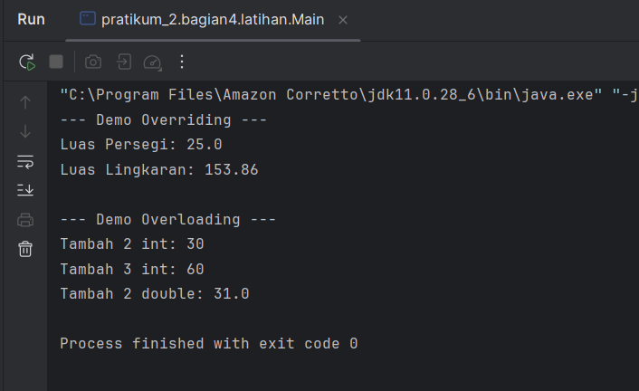

### analisis dan pembahasan

Kode program ini mendemonstrasikan dua konsep penting dalam pemrograman berorientasi objek, yaitu *overriding* dan *overloading*. Pada bagian *overriding*, objek dari kelas **Persegi** dan **Lingkaran** yang bertipe **BangunDatar** memanggil metode **hitungLuas()**, tetapi masing-masing menjalankan versi yang sudah di-*override* sesuai kelasnya, sehingga menghasilkan perhitungan luas yang spesifik. Sementara itu, pada bagian *overloading*, kelas **Matematika** memperlihatkan kemampuan satu nama metode **tambah()** digunakan untuk berbagai skenario, baik dari jumlah parameter maupun tipe datanya. Pendekatan ini membuat kode lebih fleksibel dan terstruktur, sekaligus menekankan prinsip *polimorfisme* dan efisiensi penggunaan metode dalam Java.

### BAGIAN 5

### langkah pratikum

1. Buat Sebuah package baru lagi didalam package pratikum_2 dengan cara klik kanan dan pilih New -> Package. Beri nama bagian_5
2. Buat sebuah package baru di dalam bagian_5 dan beri nama abstrak.
3. Kemudian buat sebuah class baru di dalam abtrak dengan nama Hewan dan isikan kode berikut:

       package pratikum_2.bagian5.abstrak;

        public abstract class Hewan {
        // Atribut
        String nama;

        // Method konkret
        void makan() {
        System.out.println(nama + " sedang makan.");
         }

        // Method abstrak
        abstract void bersuara();
        }  

### analisis dan pembahasan

Kode program ini memperkenalkan konsep *abstraksi* dalam Java melalui kelas **Hewan** yang bersifat *abstract*. Kelas ini memiliki atribut **nama** dan sebuah metode konkret **makan()** yang dapat langsung digunakan oleh subclass, sekaligus mendefinisikan metode **bersuara()** sebagai *abstract*, yang memaksa setiap subclass untuk menyediakan implementasinya sendiri. Dengan demikian, kelas ini berfungsi sebagai kerangka umum bagi semua hewan, memastikan bahwa setiap jenis hewan memiliki perilaku spesifik untuk bersuara, sambil tetap mewarisi fungsi umum seperti makan. Pendekatan ini membantu memisahkan definisi perilaku dari implementasinya, meningkatkan keteraturan dan fleksibilitas kode.

### langkah pratikum
1. buat class baru di dalam package abstrak dengan nama Kucing
2. ketik kode programnya

       package pratikum_2.bagian5.abstrak;

        public class Kucing extends Hewan {
        // Subclass dari abstract class
        @Override
        void bersuara() {
        System.out.println("Meong!");
         }
          }

### analisis dan pembahasan

Kode ini menampilkan implementasi *abstract class* **Hewan** melalui subclass **Kucing**. Sebagai subclass, **Kucing** wajib mengimplementasikan metode *abstract* **bersuara()**, sehingga di sini metode tersebut ditulis ulang untuk menampilkan suara khas kucing, yaitu “Meong!”. Dengan pendekatan ini, kelas **Kucing** menunjukkan bagaimana *abstraksi* memaksa setiap hewan spesifik memiliki perilaku yang unik, sekaligus tetap mewarisi metode konkret dari kelas induk, seperti **makan()**, sehingga konsep *inheritance* dan *polymorphism* dapat diterapkan dengan rapi dan terstruktur.

### langkah pratikum
1. buat class baru di dalam package abstrak dengan nama Anjing
2. ketik kode programnya

       package pratikum_2.bagian5.abstrak;

       public class Anjing extends Hewan {
       @Override
       void bersuara() {
       System.out.println("Guk Guk!");   
       }

        }

### analisis dan pembahasan

Kode ini memperlihatkan subclass **Anjing** yang merupakan turunan dari *abstract class* **Hewan**. Karena **Hewan** memiliki metode *abstract* **bersuara()**, maka **Anjing** diwajibkan untuk mengimplementasikan metode tersebut, yang dalam kasus ini menghasilkan suara khas anjing, yaitu “Guk Guk!”. Pendekatan ini menekankan prinsip *abstraksi* dalam Java, di mana setiap jenis hewan harus mendefinisikan perilakunya sendiri, sambil tetap mewarisi metode konkret dari kelas induk seperti **makan()**, sehingga desain program menjadi lebih terstruktur dan mudah dikembangkan.

### langkah pratikum
1. buat class baru di dalam package abstrak dengan nama Main
2. ketik kode programnya

       package pratikum_2.bagian5.abstrak;

       public class Main {
       public static void main(String[] args) {
       Hewan kucing = new Kucing();
       kucing.nama = "Kitty";
       kucing.makan(); // Method konkret dari abstract class
        kucing.bersuara(); // Method abstrak yang di-override

        Hewan anjing = new Anjing();
        anjing.nama = "Doggy";
        anjing.makan(); // Method konkret dari abstract class
        anjing.bersuara(); // Method abstrak yang di-override
         }
       }

### screenshoot hasil

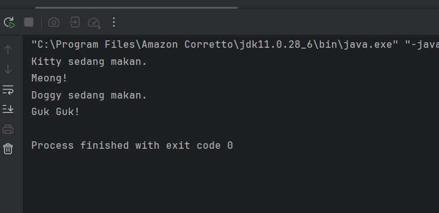

### analisis dan pembahasan

Kode program ini mendemonstrasikan penggunaan *abstract class* **Hewan** dan konsep *polimorfisme* di Java. Dalam contoh ini, objek **kucing** dan **anjing** dibuat dari subclass **Kucing** dan **Anjing**, yang masing-masing mengimplementasikan metode *abstrak* **bersuara()** sesuai karakter hewannya. Meskipun **Hewan** adalah kelas abstrak, kita masih bisa memanggil metode konkret **makan()** yang diwariskan ke kedua subclass. Pendekatan ini menekankan bagaimana *abstraksi* memungkinkan kita mendefinisikan kerangka umum untuk semua hewan, sementara perilaku spesifik tiap hewan ditentukan di subclass, sehingga kode menjadi lebih terstruktur, fleksibel, dan mudah dikembangkan.

#### langkah pratikum

1. Buat sebuah package baru di dalam bagian_5 dan beri nama antarmuka.
2. Kemudian buat sebuah interface baru di dalam antarmuka dengan nama Bergerak dan isikan kode berikut:

       package pratikum_2.bagian5.antarmuka;

        public interface Bergerak {
        // Method abstrak
        void bergerak();

        // Method default (Java 8+)
       default void berhenti() {
        System.out.println("Berhenti bergerak.");
         }

        // Method static (Java 8+)
        static void info() {
        System.out.println("Ini adalah interface Bergerak.");
        }

         }

### analisis dan pembahasan

Kode program ini menampilkan konsep *interface* di Java melalui **Bergerak**, yang mendefinisikan perilaku umum untuk objek yang memiliki kemampuan bergerak. Interface ini memiliki metode abstrak **bergerak()** yang wajib diimplementasikan oleh kelas yang mengadopsinya, memastikan setiap kelas menyatakan cara bergeraknya sendiri. Selain itu, interface ini juga memperkenalkan metode **default** **berhenti()**, yang memberi implementasi standar sehingga tidak wajib di-*override*, serta metode **static** **info()**, yang bisa dipanggil langsung dari interface tanpa membuat objek. Pendekatan ini menunjukkan bagaimana interface dapat menyediakan kontrak perilaku sekaligus fleksibilitas tambahan melalui metode default dan static.

### langkah pratikum
1. buat class baru di dalam package antarmuka dengan nama Mobil
2. ketik kode programnya

       package pratikum_2.bagian5.antarmuka;

       public class Mobil implements Bergerak {
       @Override
       public void bergerak() {
       System.out.println("Mobil sedang melaju.");
        }  
       }

### analisis dan pembahasan

Kode program ini mendemonstrasikan penerapan *interface* **Bergerak** pada kelas **Mobil**. Dengan meng-*implement* interface tersebut, kelas **Mobil** wajib menyediakan implementasi untuk metode abstrak **bergerak()**, yang dalam hal ini menampilkan pesan bahwa mobil sedang melaju. Hal ini menekankan prinsip *polymorphism* dan *abstraction*, di mana kelas yang berbeda dapat memiliki perilaku spesifik masing-masing sambil tetap mengikuti kontrak yang ditentukan oleh interface. Pendekatan ini membuat kode lebih terstruktur dan memudahkan pengembangan sistem yang konsisten terhadap objek yang memiliki kemampuan bergerak.

### langkah pratikum
1. buat class baru di dalam package antarmuka dengan nama Pesawat
2. ketik kode programnya

       package pratikum_2.bagian5.antarmuka;

       public class Pesawat implements Bergerak{
       @Override
       public void bergerak() {
       System.out.println("Pesawat sedang terbang.");
        }
         }

### analisis dan pembahasan

Kode program ini memperlihatkan bagaimana kelas **Pesawat** mengimplementasikan *interface* **Bergerak**, sehingga wajib menyediakan implementasi untuk metode abstrak **bergerak()**. Dalam konteks ini, metode tersebut menampilkan pesan bahwa pesawat sedang terbang, menggambarkan perilaku spesifik dari objek tersebut. Pendekatan ini menekankan prinsip *abstraction* dan *polymorphism*, di mana berbagai kelas yang berbeda dapat memiliki perilaku unik tetapi tetap mengikuti kontrak yang sama dari interface. Dengan begitu, kode menjadi lebih terstruktur dan fleksibel untuk pengembangan sistem yang melibatkan objek-objek bergerak.

### langkah pratikum
1. buat class baru di dalam package antarmuka dengan nama Main
2. ketik kode programnya

       package pratikum_2.bagian5.antarmuka;

       public class Main {
       public static void main(String[] args) {
       Bergerak mobil = new Mobil();
       mobil.bergerak(); // Method dari interface
       mobil.berhenti(); // Method default dari interface

        Bergerak pesawat = new Pesawat();
        pesawat.bergerak(); // Method dari interface
        pesawat.berhenti(); // Method default dari interface

        Bergerak.info(); // Method static dari interface
         }
       }

### screenshot hasil

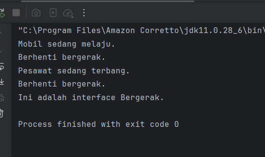

### analisis dan pembahasan

Kode program ini mendemonstrasikan penggunaan *interface* **Bergerak** secara praktis melalui objek **Mobil** dan **Pesawat**. Di sini, *interface* berfungsi sebagai kontrak yang menjamin bahwa semua kelas yang mengimplementasikannya memiliki metode **bergerak()**, sementara metode **berhenti()** disediakan sebagai metode default sehingga bisa langsung dipakai tanpa di-*override*. Program ini juga menampilkan pemanggilan metode *static* **info()** dari interface, menekankan bahwa interface tidak hanya mengatur perilaku objek, tetapi juga dapat menyimpan fungsi yang bersifat umum dan dapat diakses langsung. Pendekatan ini menunjukkan prinsip *abstraction* dan *polymorphism*, karena meski objek berbeda, keduanya bisa diperlakukan melalui tipe yang sama, yakni **Bergerak**, sehingga kode menjadi lebih fleksibel dan terstruktur.

### langkah pratikum

1. Didalam package bagian_5, buatlah sebuah class baru dan beri nama Main dan isikan kode berikut:

       package pratikum_2.bagian5;

        interface Terbang {
        void terbang();
        }
        // abstract class
       abstract class Hewan {
       String nama;

       abstract void bersuara();
        }

 
       // Class yang mewarisi abstract class dan mengimplementasikan interface
       class Burung extends Hewan implements Terbang {

       @Override
       void bersuara() {
        System.out.println("Kicau kicau!");
        }

        @Override
        public void terbang() {
        System.out.println(nama + " sedang terbang di angkasa.");
         }
        }

       public class Main {
        public static void main(String[] args) {
        Burung burung = new Burung();
       burung.nama = "Merpati";
       burung.bersuara();
       burung.terbang();  
        }
       }

### screenshoot hasil

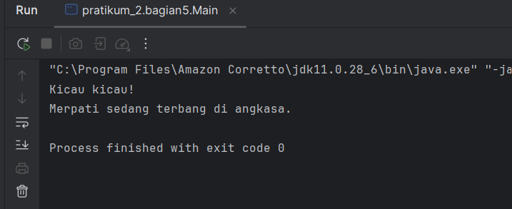

### analisis dan pembahasan

Kode program ini menunjukkan kombinasi penggunaan *abstract class* dan *interface* dalam Java melalui kelas **Burung**. *Abstract class* **Hewan** menyediakan kerangka umum dengan atribut **nama** dan metode abstrak **bersuara()**, yang harus diimplementasikan oleh subclass. Sementara itu, *interface* **Terbang** menambahkan kontrak tambahan yaitu metode **terbang()**, yang menjamin bahwa setiap kelas yang mengimplementasikannya memiliki kemampuan terbang. Kelas **Burung** kemudian menggabungkan kedua konsep ini, sehingga objek **burung** dapat memanggil metode **bersuara()** untuk mengekspresikan suara dan **terbang()** untuk menunjukkan aksi terbang, memperlihatkan prinsip *multiple inheritance* melalui interface dan penggunaan *polymorphism*. Pendekatan ini membuat kode lebih terstruktur, fleksibel, dan mudah dikembangkan untuk jenis hewan lain yang memiliki kemampuan berbeda.

### tugas latihan bagian 5 (Berenang)

### langkah pratikum
1. buat class baru di dalam package latihan dengan nama Berenag
2. ketik kode programnya

       package pratikum_2.bagian5.latihan;

       public interface Berenang {
       void berenang(); // Secara otomatis bersifat public dan abstract
        }

        // 2. Membuat Abstract Class
        abstract class HewanAir {
        protected String nama;

       public HewanAir(String nama) {
        this.nama = nama;
         }

        // Method abstrak yang wajib diimplementasikan oleh subclass
        public abstract void makan();
        }

       // 3. Class Ikan mewarisi HewanAir dan mengimplementasikan Berenang
       class Ikan extends HewanAir implements Berenang {
    
        public Ikan(String nama) {
        super(nama);
        }

        // 4. Implementasi method makan() dari HewanAir
        @Override
        public void makan() {
        System.out.println(nama + " sedang makan pelet atau plankton.");
        }

        // 4. Implementasi method berenang() dari interface Berenang
        @Ove rride
        public void berenang() {
        System.out.println(nama + " berenang dengan cara menggerakkan siripnya.");
         }
       }

### analisis dan pembahasan

Kode program ini menampilkan penerapan *abstract class* dan *interface* secara bersamaan pada konsep *hewan air*. *Abstract class* **HewanAir** memberikan kerangka dasar dengan atribut **nama** dan metode abstrak **makan()**, yang menuntut setiap subclass untuk mendefinisikannya. Sementara itu, *interface* **Berenang** menambahkan kontrak bahwa setiap kelas yang mengimplementasikannya harus memiliki metode **berenang()**. Kelas **Ikan** menggabungkan kedua konsep ini, sehingga objek ikan dapat memanggil **makan()** untuk menunjukkan aktivitas makan dan **berenang()** untuk mengekspresikan cara berenang, memperlihatkan prinsip *multiple inheritance* melalui interface. Pendekatan ini membuat kode lebih modular, terstruktur, dan fleksibel untuk dikembangkan pada jenis hewan air lainnya.

### langkah pratikum
1. buat class baru di dalam package latihan dengan nama Main
2. ketik kode programnya

       package pratikum_2.bagian5.latihan;

       public class Main {
       public static void main(String[] args) {
       Ikan ikanNila = new Ikan("Ikan Nila");

        ikanNila.makan();
        ikanNila.berenang();
         }
          }

### screensshoot hasil

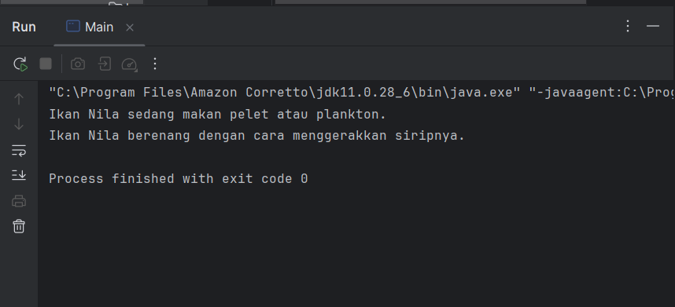

### analisis dan pembahasan

Kode program ini mendemonstrasikan penggunaan *abstract class* dan *interface* secara nyata melalui objek **Ikan**. Objek **ikanNila** dibuat dari kelas **Ikan**, yang mewarisi *abstract class* **HewanAir** dan mengimplementasikan *interface* **Berenang**, sehingga mampu memanggil metode **makan()** untuk menunjukkan aktivitas makan dan **berenang()** untuk menampilkan cara berenang. Pendekatan ini menekankan konsep *polymorphism* dan *modularitas*, di mana perilaku berbeda dapat diterapkan secara konsisten pada objek yang sama, membuat kode lebih terstruktur dan mudah dikembangkan untuk berbagai jenis hewan air lainnya.

### Bagian 6

### langkah pratikum

1. Buat Sebuah package baru lagi didalam package pratikum_2 dengan cara klik kanan dan pilih New -> Package. Beri nama bagian_6
2. Kemudian buat sebuah class baru dengan nama Tiket dan isikan kode berikut:

       package pratikum_2.bagian6;

        public abstract class Tiket {
        private final String jenis;
        private final double harga;

        public Tiket(String jenis, double harga) {
        this.jenis = jenis;
        this.harga = harga;
        }

        public String getJenis() {
        return jenis;
         }

        public double getHarga() {
        return harga;
        }

        // Abstract method untuk menghitung diskon
       public abstract double hitungDiskon();
       }

### analisis dan pembahasan

Kode program ini memperkenalkan konsep *abstract class* melalui kelas **Tiket**, yang berfungsi sebagai kerangka dasar untuk berbagai jenis tiket. Atribut **jenis** dan **harga** dijaga dengan *encapsulation* menggunakan *private final*, sehingga nilainya hanya bisa diakses melalui *getter*, menjaga keamanan data. Metode abstrak **hitungDiskon()** memaksa setiap *subclass* untuk menyediakan implementasinya sendiri, sehingga setiap jenis tiket bisa memiliki aturan diskon yang berbeda. Pendekatan ini menunjukkan bagaimana *abstract class* memadukan atribut tetap dengan perilaku yang fleksibel, mendukung prinsip *abstraksi* dan *modularitas* dalam pemrograman berorientasi objek.

### langkah pratikum
1. buat class baru di dalam package bagian 6  dengan nama tiket reguler
2. ketik kode programnya

       package pratikum_2.bagian6;

        public class TiketReguler extends Tiket {
        public TiketReguler() {
       super("Reguler", 100000); // Harga tiket reguler
       }

       @Override
        public double hitungDiskon() {
        return 0; // Tidak ada diskon untuk tiket reguler
         }
       }

### analisis dan pembahasan

Kode program ini memperlihatkan implementasi *subclass* dari *abstract class* **Tiket** melalui kelas **TiketReguler**. Pada kelas ini, konstruktor memanggil *superclass* untuk menetapkan jenis tiket sebagai “Reguler” dengan harga tetap 100.000, sehingga atribut **jenis** dan **harga** diwariskan secara otomatis. Metode abstrak **hitungDiskon()** di-*override* dengan nilai 0, menandakan bahwa tiket reguler tidak mendapatkan diskon. Pendekatan ini menekankan bagaimana *abstract class* memungkinkan definisi umum di kelas induk sambil memberikan fleksibilitas bagi setiap *subclass* untuk menyesuaikan perilaku khusus sesuai kebutuhannya.

### langkah pratikum
1. buat class baru di dalam package bagian 6  dengan nama tiket VIP
2. ketik kode programnya

       package pratikum_2.bagian6;

       public class TiketVIP extends Tiket {
        public TiketVIP() {
       super("VIP", 250000); // Harga tiket VIP
        }

        @Override
        public double hitungDiskon() {
        return 0.1 * getHarga(); // Diskon 10% untuk tiket VIP
         }
        }

### analisis dan pembahasan

Kode program ini menampilkan implementasi kelas **TiketVIP** sebagai *subclass* dari *abstract class* **Tiket**, di mana konstruktor menetapkan jenis tiket “VIP” dengan harga 250.000 melalui pemanggilan *superclass*. Metode abstrak **hitungDiskon()** di-*override* untuk menghitung diskon 10% dari harga tiket, sehingga tiket VIP mendapatkan potongan harga secara otomatis. Pendekatan ini menunjukkan bagaimana *abstract class* bisa menjadi kerangka umum untuk berbagai jenis tiket, sementara tiap *subclass* menyesuaikan perilaku spesifik, dalam hal ini terkait kebijakan diskon.

### langkah pratikum
1. buat class baru di dalam package bagian 6  dengan nama pesanan
2. ketik kode programnya

        package pratikum_2.bagian6;

        public class Pesanan {
        private final String namaPemesan;
        private final Tiket tiket;
       private final int jumlah;

       public Pesanan(String namaPemesan, Tiket tiket, int jumlah) {
        this.namaPemesan = namaPemesan;
        this.tiket = tiket;
        this.jumlah = jumlah;
        }

        public String getNamaPemesan() {
        return namaPemesan;
        }

       public Tiket getTiket() {
        return tiket;
        }

       public int getJumlah() {
        return jumlah;
        }

       // Menghitung total harga setelah diskon
        public double hitungTotal() {
        double total = tiket.getHarga() * jumlah;
        double diskon = tiket.hitungDiskon() * jumlah;
        return total - diskon;
        }

        // Menampilkan detail pesanan
       public void displayDetail() {
        System.out.println("\nDetail Pesanan:");
        System.out.println("Nama Pemesan: " + namaPemesan);
        System.out.println("Jenis Tiket: " + tiket.getJenis());
        System.out.println("Jumlah: " + jumlah);
        System.out.println("Total Harga: Rp" + hitungTotal());
         }
        }

### analisis dan pembahasan

Kode program ini memperkenalkan kelas **Pesanan** yang merepresentasikan pemesanan tiket oleh seorang pelanggan. Kelas ini menggunakan *composition* dengan menyimpan objek **Tiket**, serta menyertakan atribut nama pemesan dan jumlah tiket. Metode **hitungTotal()** menghitung total biaya dengan memperhitungkan diskon dari tipe tiket yang dipesan, sedangkan **displayDetail()** menampilkan informasi lengkap mengenai pemesanan, termasuk nama pemesan, jenis tiket, jumlah, dan total harga setelah diskon. Pendekatan ini menunjukkan konsep *encapsulation* dan *composition*, sehingga setiap pesanan bisa menyimpan data tiket dengan aman dan menghitung biaya secara otomatis, menjadikan kode lebih terstruktur dan mudah dikelola.

### langkah pratikum
1. buat class baru di dalam package bagian 6  dengan nama konferensiApp
2. ketik kode programnya

       package pratikum_2.bagian6;

       import java.util.ArrayList;
        import java.util.Scanner;

       public class KonferensiApp {
       private static final ArrayList<Pesanan> daftarPesanan = new ArrayList<>();
       private static final Scanner scanner = new Scanner(System.in);

        public static void main(String[] args) {
        while (true) {
            System.out.println("\n=== Aplikasi Pemesanan Tiket Konferensi ===");
            System.out.println("1. Lihat Daftar Tiket");
            System.out.println("2. Pesan Tiket");
            System.out.println("3. Lihat Detail Pesanan");
            System.out.println("4. Batalkan Pesanan");
            System.out.println("5. Keluar");
            System.out.print("Pilih menu: ");

            int pilihan = scanner.nextInt();
            scanner.nextLine(); // Membersihkan newline

            switch (pilihan) {
                case 1:
                    lihatDaftarTiket();
                    break;
                case 2:
                    pesanTiket();
                    break;
                case 3:
                    lihatDetailPesanan();
                    break;
                case 4:
                    batalkanPesanan();
                    break;
                case 5:
                    System.out.println("Terima kasih telah menggunakan aplikasi ini.");
                    System.exit(0);
                default:
                    System.out.println("Pilihan tidak valid. Silakan coba lagi.");
            }
         }
       }

       //  Method untuk menampilkan daftar tiket
       private static void lihatDaftarTiket() {
        System.out.println("\nDaftar Tiket:");
        System.out.println("1. Tiket Reguler - Rp100.000");
        System.out.println("2. Tiket VIP - Rp250.000 (Diskon 10%)");
        }

       // Method untuk memesan tiket
       private static void pesanTiket() {
        System.out.print("\nMasukkan nama pemesan: ");
        String namaPemesan = scanner.nextLine();
        System.out.print("Pilih jenis tiket (1: Reguler, 2: VIP): ");
        int jenisTiket = scanner.nextInt();
        System.out.print("Masukkan jumlah tiket: ");
        int jumlah = scanner.nextInt();

        Tiket tiket = null;
        switch (jenisTiket) {
            case 1:
                tiket = new TiketReguler();
                break;
            case 2:
                tiket = new TiketVIP();
                break;
            default:
                System.out.println("Jenis tiket tidak valid.");
                return;
        }

        Pesanan pesanan = new Pesanan(namaPemesan, tiket, jumlah);
        daftarPesanan.add(pesanan);
        System.out.println("Pesanan berhasil dibuat!");
        pesanan.displayDetail();
       }

        // Method untuk melihat detail pesanan
        private static void lihatDetailPesanan() {
        if (isNoPesanan()) return;

        System.out.print("Pilih nomor pesanan untuk melihat detail: ");
        int nomorPesanan = scanner.nextInt();
        if (nomorPesanan > 0 && nomorPesanan <= daftarPesanan.size()) {
            daftarPesanan.get(nomorPesanan - 1).displayDetail();
        } else {
            System.out.println("Nomor pesanan tidak valid.");
        }
        }

        private static boolean isNoPesanan() {
        if (daftarPesanan.isEmpty()) {
            System.out.println("Belum ada pesanan.");
            return true;
        }

        System.out.println("\nDaftar Pesanan:");
        for (int i = 0; i < daftarPesanan.size(); i++) {
            System.out.println((i + 1) + ". " + daftarPesanan.get(i).getNamaPemesan());
        }
        return false;
        }

       // Method untuk membatalkan pesanan
       private static void batalkanPesanan() {
        if (isNoPesanan()) return;

        System.out.print("Pilih nomor pesanan yang ingin dibatalkan: ");
        int nomorPesanan = scanner.nextInt();
        if (nomorPesanan > 0 && nomorPesanan <= daftarPesanan.size()) {
            daftarPesanan.remove(nomorPesanan - 1);
            System.out.println("Pesanan berhasil dibatalkan.");
        } else {
            System.out.println("Nomor pesanan tidak valid.");
         }
         }
       }

### screenshoot hasil

### analisi dan pembahasan

Kode program **KonferensiApp** ini merupakan implementasi sederhana dari aplikasi pemesanan tiket berbasis *console* menggunakan Java. Aplikasi ini memanfaatkan **ArrayList** untuk menyimpan objek **Pesanan** dan **Scanner** untuk menerima input pengguna. Program menyediakan menu interaktif yang memungkinkan pengguna melihat daftar tiket, melakukan pemesanan, mengecek detail pesanan, serta membatalkan pesanan secara dinamis. Tiap pesanan dibuat dengan *composition*, yakni menyimpan objek **Tiket** (baik **TiketReguler** maupun **TiketVIP**) di dalam objek **Pesanan**, sehingga total harga dan diskon bisa dihitung otomatis melalui metode yang sudah tersedia. Struktur ini memperlihatkan penerapan konsep **encapsulation**, **composition**, serta **polymorphism** sederhana, di mana pemilihan jenis tiket dilakukan secara fleksibel. Secara keseluruhan, program ini dirancang agar interaktif, terstruktur, dan mudah dikembangkan, sekaligus memberikan pengalaman belajar yang jelas tentang manajemen objek dan pemrosesan data input-output di Java.

## 3. Kesimpulan

## 4.Referensi

Praktikum 2 : Review 4 Pillar OOP Menggunakan Java

Diakses dari:https://hackmd.io/@mohdrzu/rk5sz2X21l

